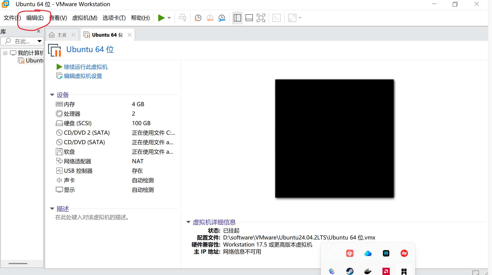
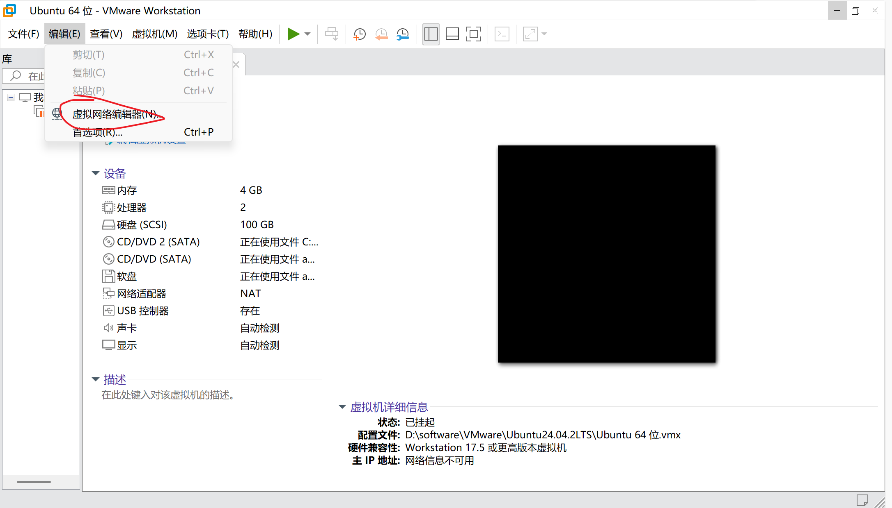
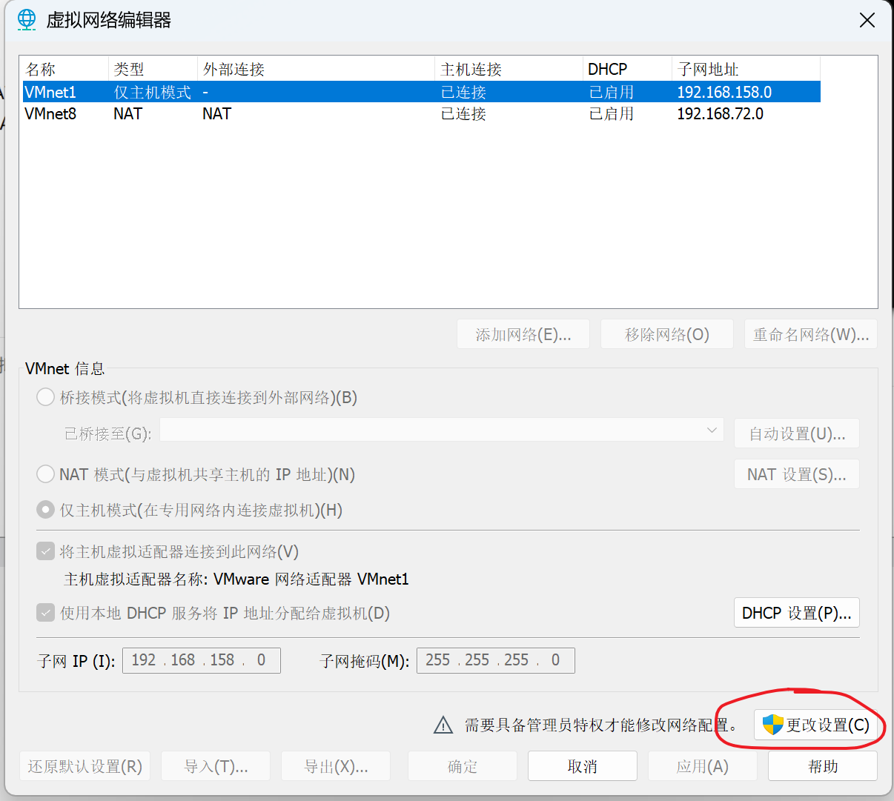
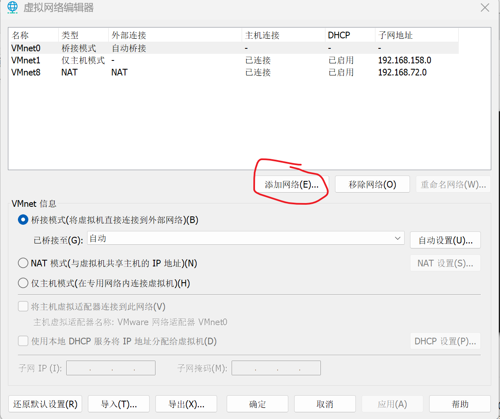
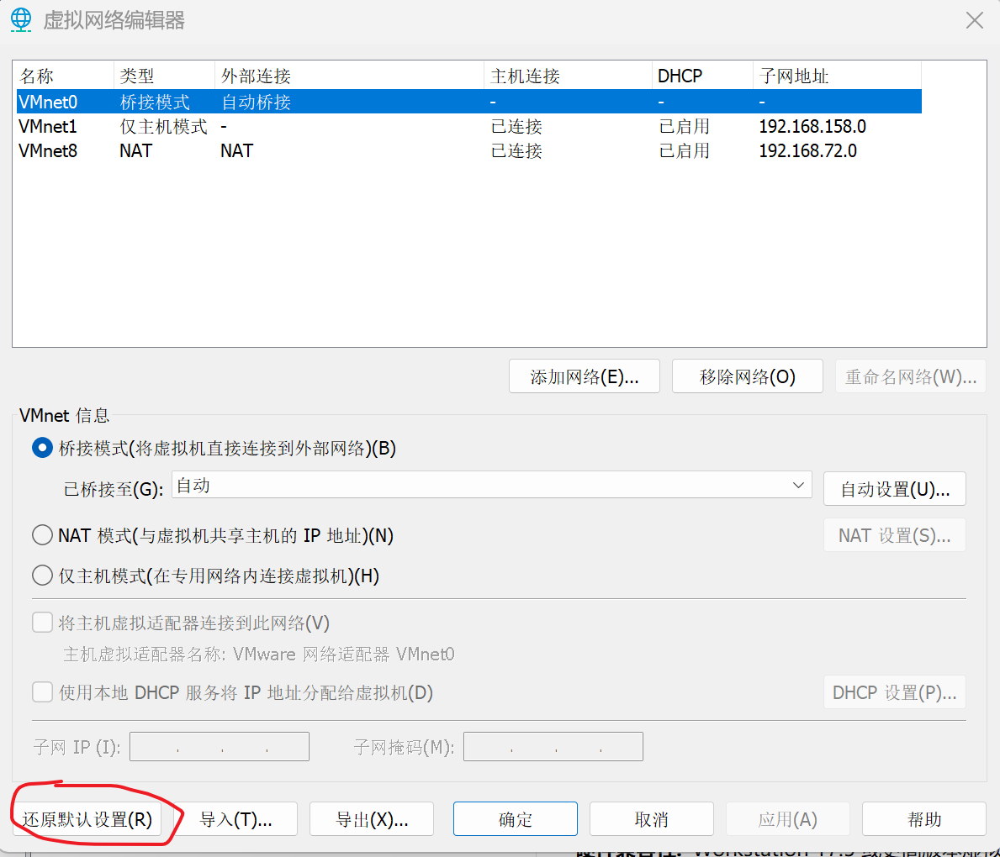

VMware虚拟机连接网络，有一个很常用的模式是NAT网络，但是在Clash开启TUN模式后，会发现网络无法正常连接，问题出现在哪里呢？

## 结论

先说结论，问题出现在VMware自己的默认设置上！Clash的TUN模式本质上不会破坏虚拟机的NAT模式网络连接，但是在TUN开启的情况下，VMware不会自动新建NAT网络类型。然而，虚拟机在创建时会默认使用NAT连接方式（明明没有这个网络类型还要硬连，VMware你到底有没有考虑过小白的感受）然后就会发现，虚拟机根本就连不上网（悲）

## 解决方案

有两种解决方式

1. 可以直接新建一个NAT网络类型。第一步，点击编辑
   
   
   
   然后再点击虚拟网络编辑器
   
   
   
   点击更改设置
   
   
   
   然后点击添加网络，注意添加的网络是NAT类型即可
   
   
   
   （实际上目前网络应该没有NAT类型，不过我这里为了方便就直接展示了，添加新网络后点击它，并且勾选NAT模式即可）

2. 第二种方法，直接关闭TUN，然后依照上面的步骤打开虚拟网络编辑器，不过我们不要手动添加网络，而是直接点击下面的还原默认设置
   
   
   
   等待设置还原后，点击确定来关闭这个窗口
   
   然后虚拟机可以上网了。如果你需要TUN模式，直接打开就行了，现在你无论开启还是不开启TUN，都不会影响你的虚拟机网络连接！不过要注意，这时候不要再动网络设置了哦

