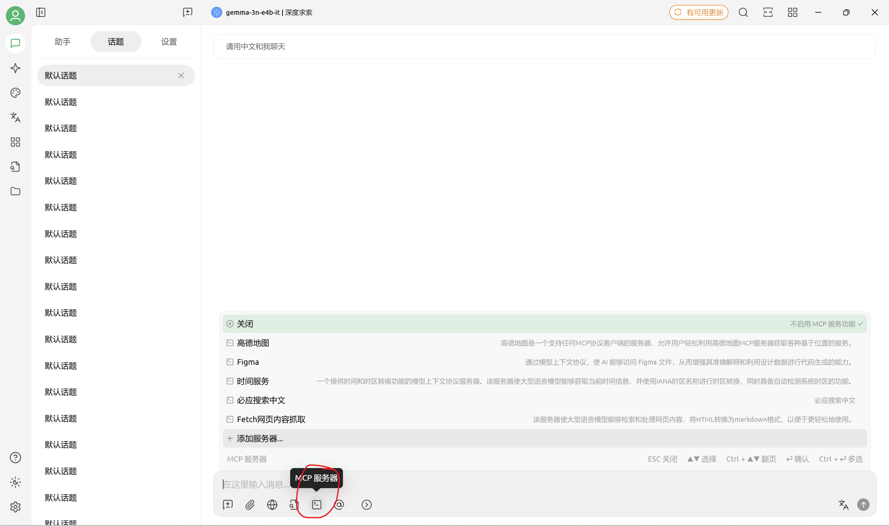
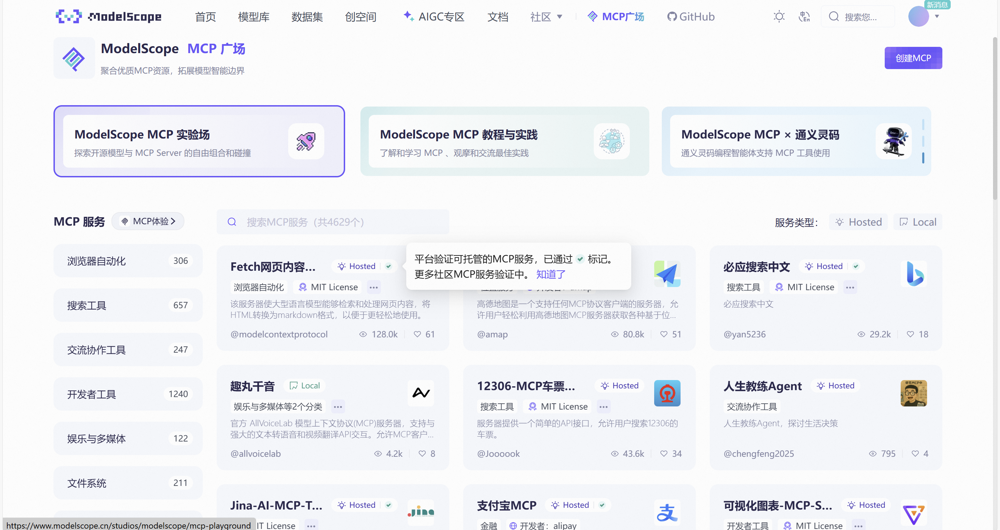
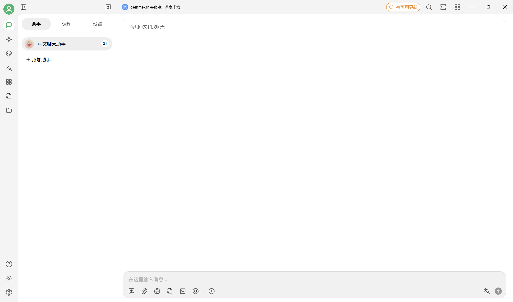

## MCP没有那么复杂

大概在今年年初，MCP开始流行，媒体纷纷下场庆祝，仿佛通用agent近在眼前。在这样的宣传背景下，很多人对MCP的印象是“复杂”，“高大上”。但实际上，它的底层原理，远比我们认识的简单

MCP，全名为“模型上下文协议（Model Context Protocol）”，它相当于一个非常详细的合同，规定了数据交换的方式，所有遵守这个合同的MCP服务器，与MCP客户端（MCP服务器与客户端的概念，我会在后文详细解释），都能够自由的通信。举个例子，大家的无论使用什么浏览器，都能够访问同样的网页。无论你使用的是Firefox，Safari，还是Chrome，尽管他们的内核不同，底层有区别，但是他们都遵守web标准，所以开发者只用开发一套网页，所有浏览器均可查看。MCP是同样的道理。

## mcp具体内容

那么，说了这么多，MCP究竟规定了什么？最好的方式是去官网查看https://modelcontextprotocol.io/specification/   ，不过官方说的很技术，或许不好理解。

没关系！让我来简单讲一讲

### 架构

对于MCP，首先要了解的是客户端-服务器（Client-Server）架构。MCP客户端（client）可以理解为能够标准化的支持MCP的AI客户端。比如，我电脑上装了一个本地AI运行软件，可以运行装在我电脑上的大模型，而这个软件又支持MCP，那么这个程序就可以成为MCP客户端。

（图片中的软件是我使用的Cherry Studio，支持MCP工具，所以这个软件就可以理解为MCP客户端）

而细心的同学可能发现了，在截图中，我用红圈圈出MCP服务器（server）。这是什么？对于MCP服务器，我们可以理解为数据转换器，专门将外界的信息转化为MCP要求的格式。

举个例子吧，我们电脑上的文件目录，就算是一种信息。但是，如果我问AI，我的电脑文件夹乱不乱？AI或许会礼貌的回答，无权查看我的电脑。当然！AI是没有权利查看的。所以，我写了一个程序，能够获取到我电脑上文件目录。但是，问题又来了，我应该怎么将这个信息告诉AI呢？

我想到，我的AI软件支持MCP啊！所以我在程序对外的接口中，专门将这个目录信息，组织成MCP要求的数据格式，并发送给我的AI软件。哈，AI成功的知晓了我的文件目录，告诉我：太乱了！

等等，整个MCP处理流程跑完了，MCP服务器在哪呢？当然就是我们刚写的程序！这个程序获取到了我的文件目录（信息A），又将它转化为MCP支持的数据格式（信息B）。这就是MCP服务器的核心功能

### 资源

其实，在上文中，MCP服务器向客户端提供的符合协议的数据，即资源。资源是静态的，MCP服务器并不关心AI是否真的利用好了资源，它只负责把资源传递给客户端。

### 工具

尽管MCP全文为模型上下文协议，但是，MCP给予AI的可不单单是信息，还给予了AI去运行函数的能力。（函数，通俗理解，是一段可以运行的代码，提供的参数不同，运行结果不同）。工具不同于资源，尽管它也和资源一样，会被MCP服务器发送工具的具体信息给MCP客户端，但是工具并不是甩手掌柜，它会等待着客户端告诉服务器，是否要运行这个工具。如果MCP服务器收到了客户端要求运行某个函数的请求，并且传递过来正确的函数参数，MCP服务器便会开始执行这个函数

还是咱们刚刚做出来的MCP服务器。现在，我们往这个程序里写几个函数，一个函数可以新增文件夹，另一个函数可以删除文件夹，还有一个函数可以移动文件夹。好了，现在我和AI说，帮我整理电脑中的目录吧。AI表示：？？？

为什么我写了函数，AI没法调用？AI能调用就见鬼了。首先，咱们悄咪咪写的函数，AI根本就不知道。其次，即使AI知道，它也不明白如何去调用这些函数。

幸好，MCP规定了，MCP服务器应当告诉AI有关工具（也就是函数）的描述，例如：这个函数有什么功能，接受什么参数，应该在什么时候调用。同样，MCP也规定了，如果AI想要调用某个函数，应该向服务器发送什么格式的信息，告诉服务器我想要调用XX函数，使用XX参数。

ok！那问题就简单了，首先，咱们的程序，要发送信息给AI，告诉AI，我有这3个函数，功能分别是什么，需要什么参数。随后，我们的程序就等待客户端传过来数据。当程序收到数据，解析后发现，数据内容正好是某个函数以及它的参数，那么咱们的程序就会执行这个函数。

很好，我们的MCP服务器非常强大，可以开源给别人使用了

## 本地？云端？

之前，我们制作的程序，也就是咱们的MCP服务器，很明显是本地运行的。那读者有没有想过，MCP服务器能够托管在云端？完全可以！在早期，MCP服务器确实以本地部署为多数，但是现在已经出现了一下云端运行的MCP托管平台，无需下载部署，即可将MCP接入到客户端。其中比较典型的是魔搭社区的MCP广场：[MCP 广场 · 魔搭社区](https://www.modelscope.cn/mcp)

顺带推荐一个AI聊天客户端，Cherry Studio：[Cherry Studio 官方网站 - 全能的 AI 助手](https://www.cherry-ai.com/)

