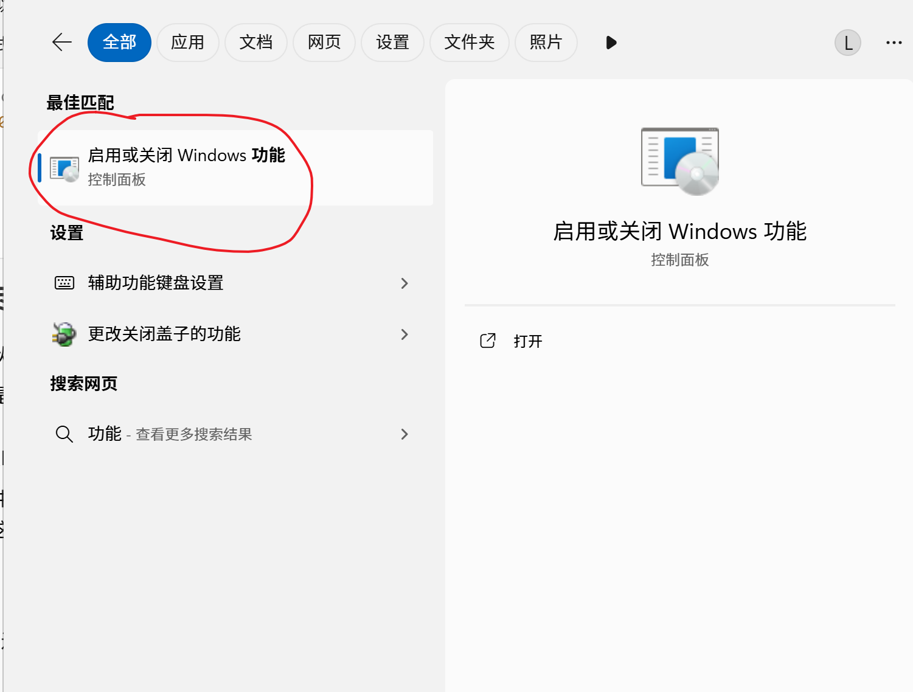
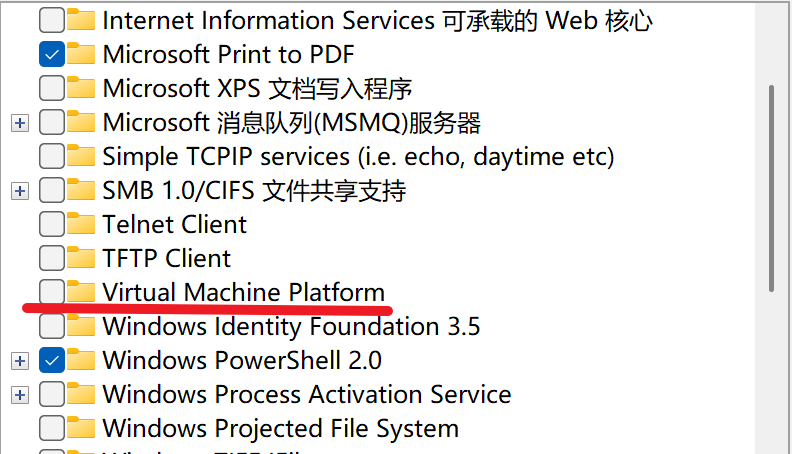
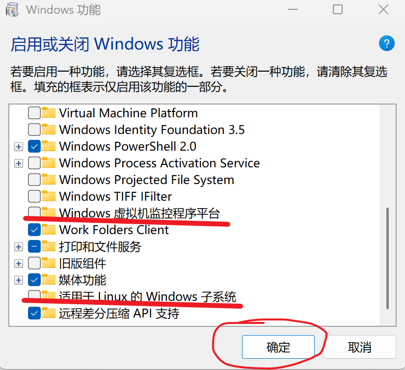
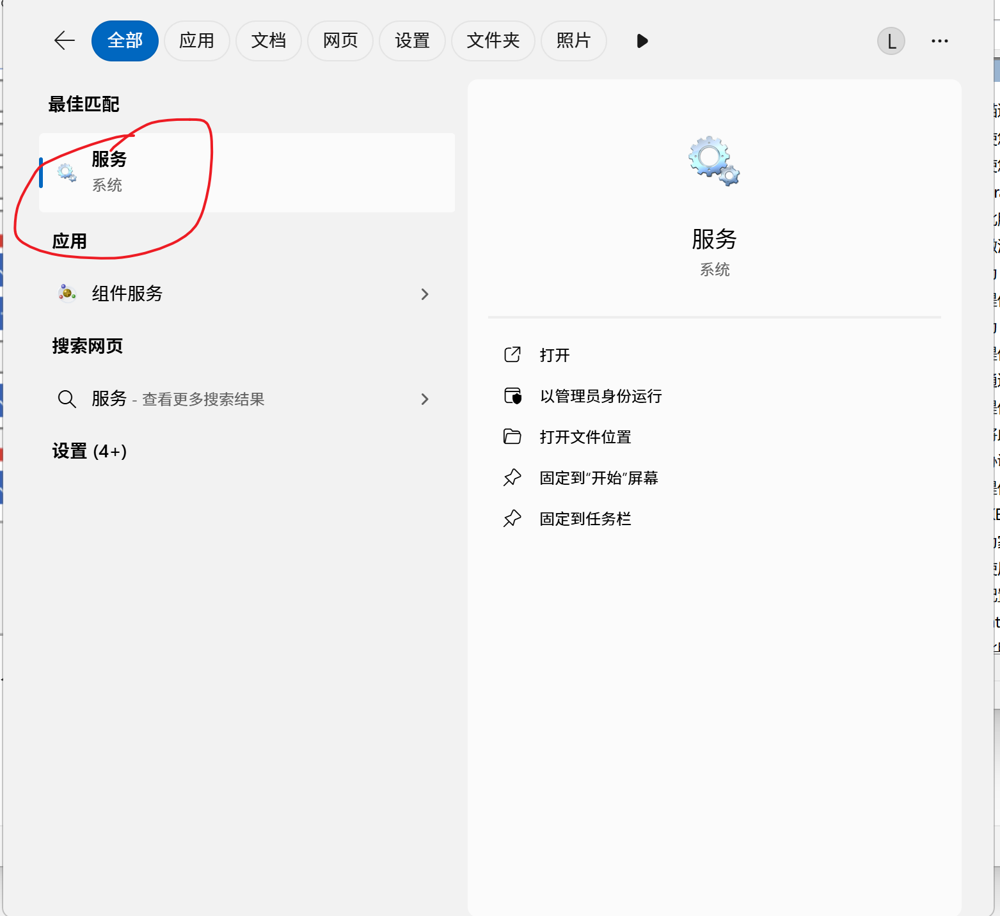
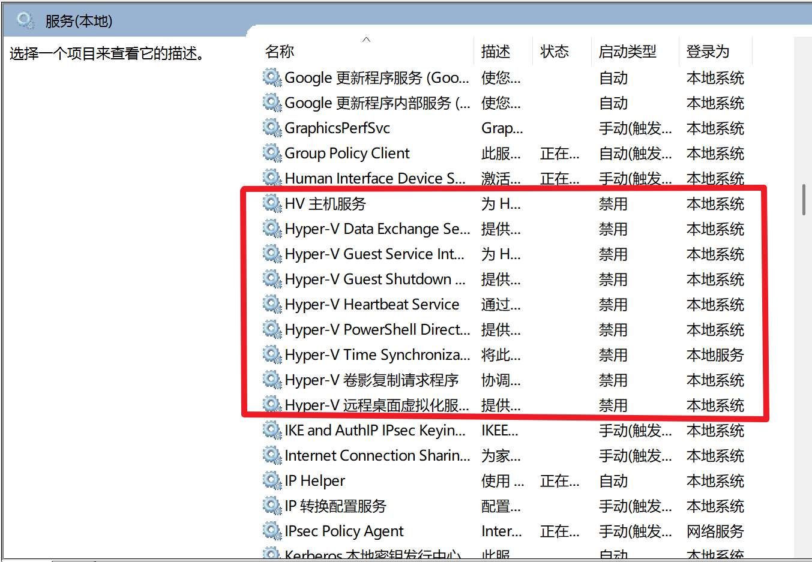
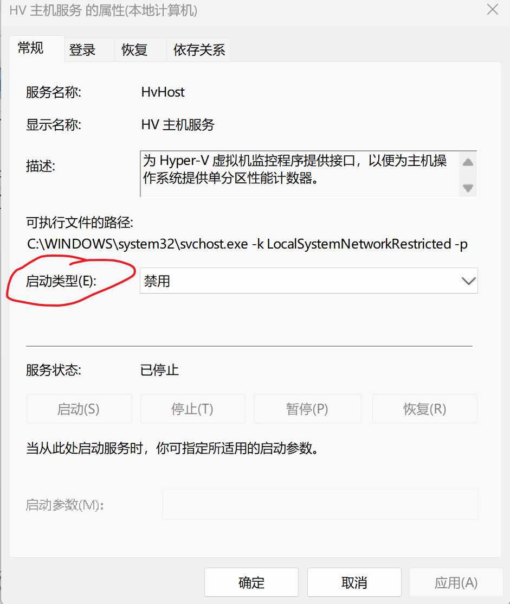

## 微软你坏事做尽！

正在折腾VMware虚拟机，无法开启cpu虚拟化，导致虚拟机的性能骤降。在开启时出现错误提示：此平台不支持虚拟化，我？？？

后来经过网络搜索，是微软有关hyper-v和虚拟化安全性相关设置导致。不过，微软家庭版按照道理来说，是不提供hyper-v的。所以，在windows功能选项中，仅能关闭虚拟机平台以及其他和虚拟机相关的，寥寥无几的选项。但是，hyper-v实际上在家庭版上是默认开启的，包括wsl之类的功能是依赖hyper-v的（微软笑话）

另外，windows系统中的虚拟化安全性可以在组策略中关闭，但仅限专业版！（专业版关闭方法自行上网查阅）尼玛家庭版不是阉割了这个功能，而是阉割了关闭这个功能的开关，微软真有你的

## 如何关闭

首先，hyper-v的关闭还是比较简单的。先是按照网络提供的方法，把能够关闭的虚拟机相关设置关闭

然后在输入框中输入服务

关闭hyper-v相关服务（双击服务进入选项卡，将启动类型改为禁用）

hyper-v随之关闭。当然，已经启动的服务不会马上关闭，不过不用担心，之后重启电脑会关闭的，如果不放心可以右键正在运行的hyper-v服务选择停止

然后，咱们来关闭虚拟化安全性

去微软官网下载Guard 和 Credential Guard工具，[Download Device Guard and Credential Guard hardware readiness tool from Official Microsoft Download Center](https://www.microsoft.com/en-us/download/details.aspx?id=53337)  

**打开PowerShell（管理员模式），输入 set-ExecutionPolicy RemoteSigned ，选择y**  

**cd到解压后的路径下，然后输入.\DG_Readiness_Tool_v3.6.ps1 -Disable，执行该程序**

（注意，最后一步，系统可能给出未找到注册项之类的异常输出，但这是正常情况，是否成功还要看下一步）

重启电脑，电脑应该会显示正在更新。更新后电脑会自动进入一个黑底白字的界面。如果是，按三次F3，电脑会自动进入桌面

如果不是，那恐怕上一步并没有成功（希望你不会碰到！）

如果执行成功，那么，虚拟机可以启动cpu虚拟化功能了！

